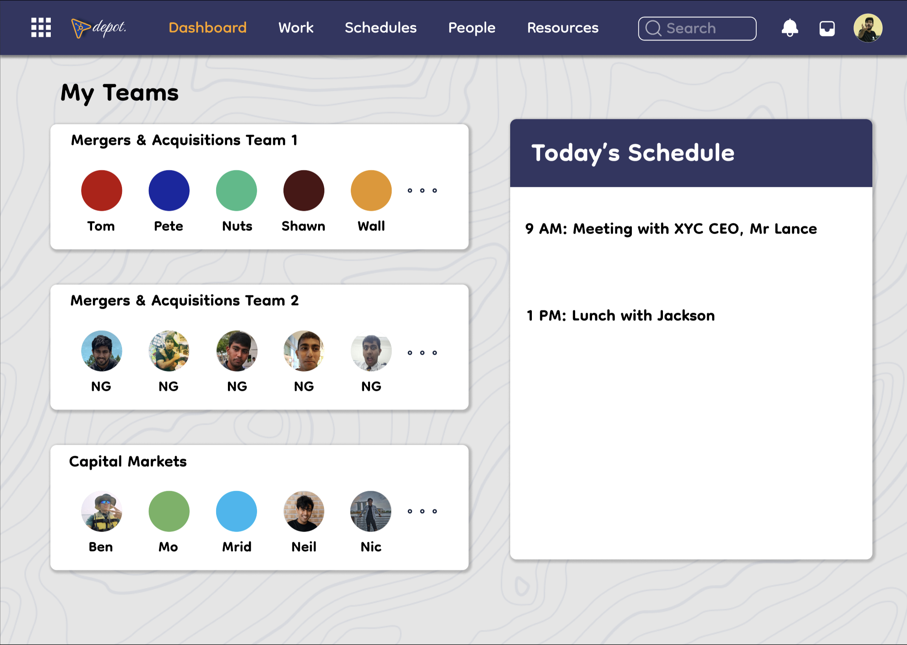
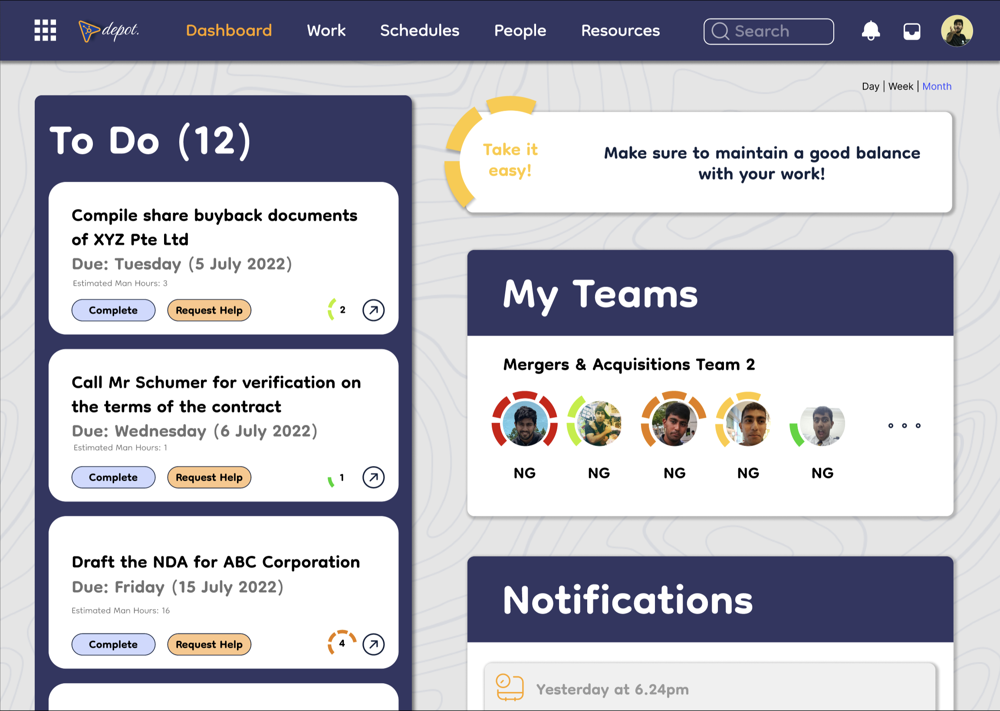
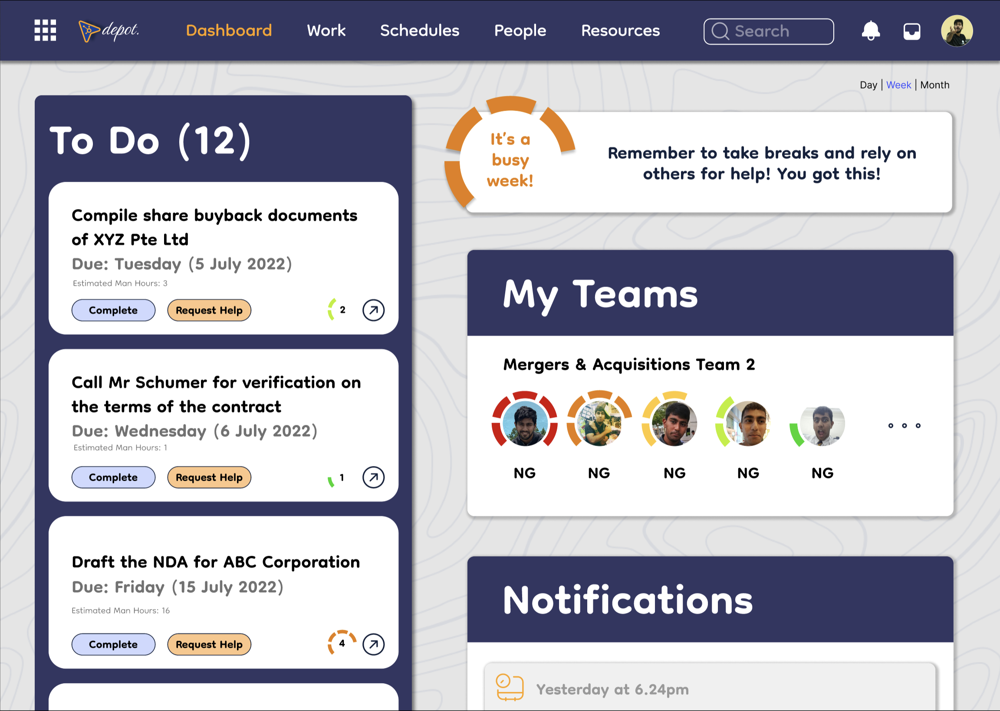
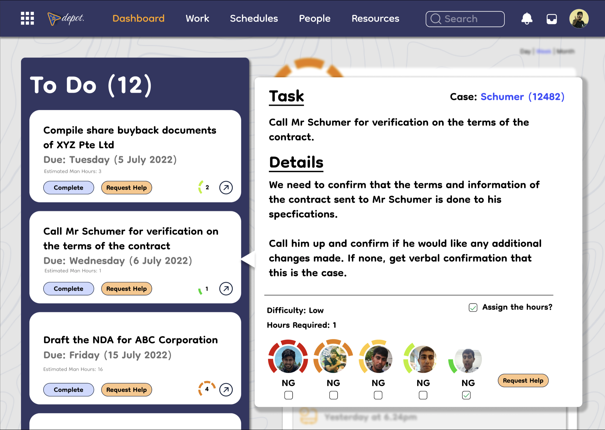
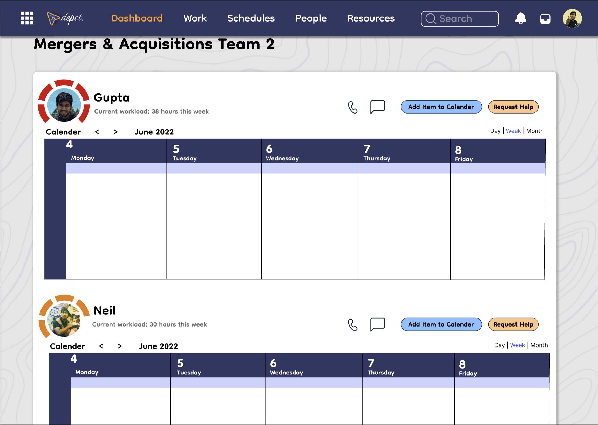

# Sirgonethese

Depot is the revolutionary Hub for Law Firm Efficiency. This is a project management solution that will streamline how work is allocated and assigned in every law firm team. Law firm partners often wonder if work is allocated efficiency and equitably among associates. Depot will streamline and facilitate the seamless delegation of work matters.

Depot features the following key functions:

A bird’s eye view on your team members’ individual capacity, reflected by coloured rings and expected capacity based on current assignments.

Assign matters and specific tasks to the relevant associate(s) based on projected capacity and matter expertise.
Sort tasks based on urgency, expertise and estimated work hours.

View each team members’ availability for the day or upcoming week, including their main schedule and meetings.
Split tasks between associate(s) based on their weekly

Track the progress of work based on work done, reviewed and cleared.

Track the team’s burn-out based on recent work load, business and capacity

Customize your Team’s weekly / monthly hours or billable targets, based on work tempo and client expectations. This also prevents overworking and burnout.

Overloading in a particular time period will be reflected in the reports, and superiors can reward their teams for such effort.

With Depot, you will be able to better monitor the capacity, performance and burn-out of your team. Manage your team #likeaboss, with Depot.

